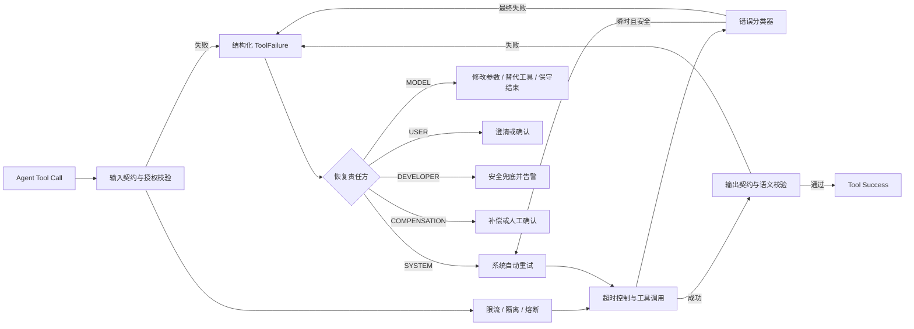

# Agent 业务工具异常处理设计方案

> 日期：2026-07-15  
> 状态：Draft，供评审  
> 适用范围：`stockmind-agent` / `javascope-agent-*`  
> 核心原则：基础设施错误由运行时确定性处理，参数与可替代业务错误交给 Agent 决策，缺少授权或关键信息交给用户，未知程序错误交给开发者处理。

## 实施进度

- [x] **第一步：统一业务工具错误返回，避免污染核心 Observations**（2026-07-15）
  - 新增 `StockToolError` 作为股票业务工具的稳定错误表，统一管理 `error_code`、安全公开消息和 `retryable`。
  - 业务工具禁止将异常消息或异常类名写入失败结果；未知依赖错误只返回预定义公开消息。
  - 失败结果统一输出 `validation_errors`、`retryable`、`error_code`、`data=null` 和 `metadata={}`。
  - 知识库和财报检索零结果改为 `KNOWLEDGE_NOT_FOUND` / `REPORT_NOT_FOUND`，不再作为可用成功证据。
  - 行情无数据使用 `MarketDataNotFoundException` 与参数错误分离，不再依赖异常文案猜测错误类型。
  - Observation 只在 `status=success && validation_passed=true` 时投影 `key_data`；失败时保留安全错误摘要，原始 `data` 仅留在审计日志。
  - 边界：本步先在现有兼容字段上落地；`ToolErrorCategory` / `RecoveryOwner` / `allowedActions` 仍属后续统一错误协议工作。
- [x] **第二步：落地运行时统一错误协议和分类器**（2026-07-15）
  - SPI 新增 `ToolError`、`ToolErrorCategory`、`RecoveryOwner`、`RecoveryAction` 和 `ToolErrorClassifier`；`ToolExecutionResult` 新增结构化 `error` 并保留旧构造器和顶层兼容字段。
  - Core 新增 `DefaultToolErrorClassifier`，统一分类参数、授权、无数据、限流、超时、网络、依赖、输出契约和未知内部错误。
  - `ToolResultFactory` 成为统一失败结果入口，并统一生成不含 `exceptionType/detailsRef` 的 Prompt 安全错误视图。
  - `DefaultAgentToolExecutor` 已覆盖注册、输入契约、语义校验、授权、中间件、调用器、输出契约及未预期运行时异常。
  - `ReflectiveAgentToolExecutor` 已展开反射异常，将空结果/非法 JSON 分类为输出契约错误，且不再把异常类名写入公开消息。
  - 限流、计划创建/修订、计划前置失败、澄清策略失败和业务工具失败均已输出同一 `error` 结构。
  - 重试中间件改为仅重试幂等且属于瞬时错误的调用；最终失败会移除 `RETRY_SAME_CALL`，并投影 Attempt 摘要。
  - Observation 仅投影 `category/code/public_message/recovery_owner/allowed_actions/retryable`；失败原始数据、内部异常和详细契约错误不进入 Prompt。
  - 边界更新：真实工具 Attempt 超时、请求 Deadline、请求级 RetryBudget 与分类重试已完成；熔断和并发 Bulkhead 仍属于后续步骤。
- [x] **第三步：框架错误码枚举化与新增类注释完善**（2026-07-15）
  - SPI 新增 `ToolErrorCode`，统一定义注册、禁用、契约、授权、限流、超时、网络、反射结果、计划、澄清和未知内部错误码。
  - 框架代码不再直接书写 `TOOL_RESULT_INVALID_JSON` 类字符串；执行器、中间件、反射适配器和控制工具统一引用枚举。
  - `ToolErrorClassifier` 同时保留字符串错误码入口，供 `StockToolError` 等业务域错误使用，避免通用 SPI 枚举被业务码污染。
  - 已为 `ToolErrorCode`、`ToolError`、`ToolErrorCategory`、`RecoveryOwner`、`RecoveryAction`、`ToolErrorClassifier`、`DefaultToolErrorClassifier` 和 `MarketDataNotFoundException` 补齐类、字段、枚举值或关键方法注释。
- [x] **第四步：错误可达性与失败恢复闭环（7 点）**（2026-07-15）
  1. [x] 新增 `ToolFailureRecord`，只保存可进入 Prompt 的错误分类、公开消息、恢复责任方、允许动作、尝试次数和调用指纹；内部异常与失败原始数据不进入该记录。
  2. [x] `RuntimeState` 新增 `activeToolFailures`、`blockedActionFingerprints` 和 `unavailableTools`，分别表达尚未解除的失败、同参调用禁令和工具级不可用状态。
  3. [x] direct/react 的 `ToolCallDispatcher` 与 planned 的 `PlanExecutor` 共用 `ToolFailureTracker`；执行器最终失败、策略拒绝和计划前置失败都会在下一轮模型调用前完成记录。
  4. [x] 相同失败 `tool+input` 会在分发前被阻止；`INPUT_INVALID` 允许修改输入后再次调用；`DEPENDENCY_UNAVAILABLE` / `CIRCUIT_OPEN` 会阻止整个工具，真实成功探测后解除；成功重规划会解除旧计划前置失败。用户确认属于新一轮请求，新建 `RuntimeState` 后授权确认失败自然解除。
  5. [x] 新增独立 `active_tool_failures` 区域，保留全部活跃失败，不按工具名去重，也不受普通 history/evidence 窗口挤压；`latest_tool_observations` 继续只表达每个工具的最新事实。
  6. [x] `DefaultPromptAssembler` 改为按“历史 → 证据摘要 → 计划/工具 Schema 压缩”逐区重渲染，删除原始字符串尾部截断；系统规则、当前约束、活跃失败和最新观察始终保留，强制区域自身超预算时宁可显式超预算也不破坏错误可达性。
  7. [x] 新增无外部测试框架依赖的三模式验收程序，覆盖最终失败记录、同参阻断、改参恢复、工具不可用/恢复、同工具多失败投影和最小预算 Prompt 可达性。
  - 验收结果：12 模块 `test-compile` 通过，`ToolFailureRecoveryAcceptanceTest` 主程序通过。
- [x] **恢复并强化 ReAct 跨轮调查状态**（2026-07-16）：保持 `selected_action` 单动作协议和工具顺序执行不变，新增不可被普通历史裁剪的 `investigation_state`，持续保存问题框架、候选假设、已确认事实、反证检查和排序后的信息缺口。
- [x] **以结构化 `reasoning_update` 替换轻量审计摘要**（2026-07-16）：ReAct 每轮按“新增事实 → 假设更新 → 反证检查 → 信息缺口排序 → 可执行性判断 → 结果分支 → 停止判断”输出更新。Core 确定性校验证据步骤引用、假设变化依据、声明工具与实际工具一致性，并要求动作对应最高优先级且 `actionable=true` 的缺口；首轮无证据时允许空反证列表，不可用工具、缺少必要输入和已失败同参调用不能继续作为可执行动作。无效更新不执行本轮工具，并把具体错误反馈给下一轮修正。
- [x] **增加证据字段级容错与业务侧 K 线摘要**（2026-07-16）：混入说明文字的证据引用自动提取真实 `source_step`，本轮只有一个有效观察来源时可安全归一；无法归一的单个字段只产生纠正警告并回退对应假设判断，不再拖垮整轮动作。K 线区间摘要由 `stockmind-application` 计算并作为 `historical_bars.data.series_summary` 返回；Context/Core 仅处理通用 JSON 投影和通用调查状态，不识别工具名、K 线字段或涨跌方向。

## 1. 背景与目标

项目当前已经具备统一 `ToolExecutionResult`、输入/输出契约校验、语义校验、授权、限流、幂等、缓存、有限重试、计划失败恢复、执行日志和最终答案兜底等基础能力。

当前主要问题不是“无法发现工具错误”，而是“错误发生后没有形成稳定的恢复闭环”：

- 业务工具经常只返回 `validation_errors`，`error_code` 为空，运行时无法稳定分类。
- direct/react 模式主要依赖 `validationFeedback` 文案让模型自行处理错误。
- `retryable=true`、自动重试和相同动作去重之间缺少统一语义。
- 工具定义中的 `timeoutMs` 尚未形成实际超时控制。
- 缺少熔断、并发隔离、统一重试预算和补偿流程。
- planned 模式具备失败历史与 `revise_plan`，但工具重试和计划修订的职责边界不够清楚。

本方案目标：

1. 建立稳定、低基数、可执行策略化的工具错误分类。
2. 将系统重试限制在单个 Agent 轮次内部，不增加特殊修复轮次。
3. 让模型只处理它真正能够修复的错误，不让模型决定网络重试、退避和熔断。
4. direct、react 和 planned 共用同一错误协议，但采用不同恢复路径。
5. 确保工具失败后能够重试、换参、换工具、询问用户、补偿或保守结束，不再空转。
6. 建立可观测、可告警、可回放、可测试的错误治理体系。

主流 Agent 工作流通常按责任方拆分错误：瞬时错误由系统自动重试；LLM 可修复错误写入状态后重新决策；用户可修复错误暂停并询问；未知异常交给开发者处理。[LangGraph 错误处理建议](https://docs.langchain.com/oss/python/langgraph/thinking-in-langgraph)

MCP 同样区分协议错误与工具执行错误，并建议客户端执行输入校验、访问控制、限流、结果校验、超时和审计。[MCP Tools 规范](https://modelcontextprotocol.io/specification/2025-06-18/server/tools)

## 2. 设计原则

### 2.1 错误处理责任分离

| 责任方 | 负责的错误 | 典型动作 |
|---|---|---|
| SYSTEM | 超时、网络错误、限流、依赖暂时不可用 | 重试、退避、熔断、隔离 |
| MODEL | 参数非法、业务规则冲突、无数据、存在替代工具 | 修改参数、选择替代工具、保守结束 |
| USER | 缺少关键业务语义、授权或高风险确认 | 澄清、确认、补充信息 |
| DEVELOPER | 输出契约错误、未知内部错误、代码缺陷 | 告警、排查、降级 |
| COMPENSATION | 有副作用且结果状态不确定 | 查询状态、补偿、人工介入 |

### 2.2 重试不等于 ReAct 新轮次

网络错误、限流等系统级重试必须在一次工具调用内部完成。只有系统完成有限重试并得到最终失败结果后，才把失败作为一次 Observation 交给 Agent。

因此仍保持固定的 10 轮 Action/Observation 循环，不恢复 `parameterRepairRequired`、`actionCorrectionRequired` 或额外修复轮次。

### 2.3 预期业务失败不抛异常

以下情况应返回结构化失败结果：

- 参数不满足业务规则。
- 指定对象或期间无数据。
- 数据尚未准备完成。
- 用户没有权限。
- 上游明确返回限流或服务不可用。

只有未预期的程序缺陷才抛异常，由运行时转换为 `INTERNAL_ERROR`。

### 2.4 模型只看到安全错误信息

- `publicMessage` 可以进入 Prompt 和最终答案。
- 异常类型、堆栈、SQL、连接信息等只写内部日志。
- 对模型提供允许的恢复动作，而不是完整异常详情。

## 3. 目标处理链路



推荐执行顺序：

1. 工具注册和可见性检查。
2. 输入 Schema 与业务语义校验。
3. 授权和用户确认校验。
4. 幂等保护。
5. 限流、Bulkhead 和熔断校验。
6. 单次调用超时控制。
7. 实际业务工具调用。
8. 错误分类和安全自动重试。
9. 输出 Schema 与业务语义校验。
10. 生成最终 `ToolExecutionResult` 和恢复指令。
11. 写入 Trace、指标和 Agent WorkingContext。

## 4. 统一错误模型

> ✅ **已落地（第二步，2026-07-15）**：以 SPI 类型作为跨模块协议，旧字段保留兼容，Prompt 仅接收安全错误视图。

### 4.1 ToolError

保留当前 `ToolExecutionResult` 的兼容字段，新增结构化错误对象：

```java
public record ToolError(
        ToolErrorCategory category,
        String code,
        String publicMessage,
        RecoveryOwner recoveryOwner,
        List<RecoveryAction> allowedActions,
        boolean retryable,
        Long retryAfterMs,
        String exceptionType,
        String detailsRef
) {}
```

字段约束：

- `category`：跨工具稳定的大类，用于运行时策略。
- `code`：业务或依赖级稳定错误码，例如 `REPORT_NOT_FOUND`。框架级错误必须使用 `ToolErrorCode`，业务域错误由各模块的预定义错误枚举管理。
- `publicMessage`：可以安全展示给模型和用户的简洁说明。
- `recoveryOwner`：决定谁负责下一步恢复。
- `allowedActions`：运行时允许模型或系统执行的动作集合。
- `retryable`：表示该错误能力上是否适合重试，不代表当前策略一定重试。
- `retryAfterMs`：上游提供的建议等待时间。
- `exceptionType`：仅供内部观测，默认不进入 Prompt。
- `detailsRef`：关联内部完整错误日志，避免把堆栈放入执行结果。

### 4.2 错误分类

```java
public enum ToolErrorCategory {
    INPUT_INVALID,
    AUTH_CONFIRMATION_REQUIRED,
    NOT_AUTHORIZED,
    BUSINESS_RULE_VIOLATION,
    NO_DATA,
    NOT_FOUND,

    RATE_LIMITED,
    TIMEOUT,
    NETWORK_ERROR,
    DEPENDENCY_UNAVAILABLE,

    OUTPUT_CONTRACT_VIOLATION,
    INTERNAL_ERROR,
    CIRCUIT_OPEN,
    BULKHEAD_REJECTED,
    CANCELLED,

    SIDE_EFFECT_UNCERTAIN
}
```

### 4.3 恢复责任方与动作

```java
public enum RecoveryOwner {
    SYSTEM,
    MODEL,
    USER,
    DEVELOPER,
    COMPENSATION
}
```

```java
public enum RecoveryAction {
    RETRY_SAME_CALL,
    MODIFY_INPUT,
    USE_ALTERNATIVE_TOOL,
    ASK_USER,
    FINALIZE_WITH_LIMITATION,
    COMPENSATE,
    ABORT
}
```

### 4.4 尝试信息

```java
public record ToolAttemptSummary(
        int attemptCount,
        int maxAttempts,
        boolean retryExhausted,
        long totalDurationMs
) {}
```

兼容后的结果示例：

```json
{
  "tool": "financial_report_metrics",
  "status": "failed",
  "validation_passed": false,
  "validation_errors": ["财报数据服务暂时不可用"],
  "retryable": true,
  "error_code": "VECTOR_STORE_UNAVAILABLE",
  "error": {
    "category": "DEPENDENCY_UNAVAILABLE",
    "code": "VECTOR_STORE_UNAVAILABLE",
    "public_message": "财报数据服务暂时不可用",
    "recovery_owner": "MODEL",
    "allowed_actions": [
      "USE_ALTERNATIVE_TOOL",
      "FINALIZE_WITH_LIMITATION"
    ],
    "retryable": true,
    "retry_after_ms": 1000
  },
  "attempt": {
    "attempt_count": 3,
    "max_attempts": 3,
    "retry_exhausted": true,
    "total_duration_ms": 1850
  },
  "data": null,
  "metadata": {
    "call_id": "call_xxx",
    "trace_id": "trace_xxx"
  }
}
```

## 5. 错误策略矩阵

| 错误类别 | 系统策略 | Agent/用户策略 | 相同调用是否允许再次出现 |
|---|---|---|---|
| `INPUT_INVALID` | 不重试 | 修改输入 | 仅允许不同输入 |
| `BUSINESS_RULE_VIOLATION` | 不重试 | 修改业务参数或结束 | 仅允许不同输入 |
| `NO_DATA` / `NOT_FOUND` | 不重试 | 换范围、换工具或披露无数据 | 默认禁止相同调用 |
| `AUTH_CONFIRMATION_REQUIRED` | 暂停 | 请求用户确认 | 确认后允许 |
| `NOT_AUTHORIZED` | 立即失败 | 替代工具或结束 | 禁止 |
| `RATE_LIMITED` | 遵守 `retryAfter` 后有限重试 | 耗尽后换工具或结束 | 由系统在同一轮内重试 |
| `TIMEOUT` / `NETWORK_ERROR` | 指数退避有限重试 | 耗尽后选择替代 | 由系统在同一轮内重试 |
| `DEPENDENCY_UNAVAILABLE` | 重试并计入熔断 | 替代工具或保守结束 | 最终失败后禁止 |
| `OUTPUT_CONTRACT_VIOLATION` | 不重试，原始数据仅审计 | 禁止使用该结果 | 禁止 |
| `INTERNAL_ERROR` | 幂等工具最多谨慎重试一次 | 安全降级并告警 | 最终失败后禁止 |
| `CIRCUIT_OPEN` | 快速失败 | 换工具或结束 | 禁止 |
| `BULKHEAD_REJECTED` | 短暂等待或快速失败 | 换工具或结束 | 由系统策略决定 |
| `SIDE_EFFECT_UNCERTAIN` | 禁止盲目重试 | 查询状态、补偿或人工确认 | 禁止直接重放 |

## 6. 自动重试策略

### 6.1 允许条件

```text
允许自动重试 =
    tool.idempotent
    AND (tool.readOnly OR invocation.idempotencyKey 非空)
    AND error.retryable
    AND error.category 属于瞬时错误
    AND 未超过单次调用最大尝试次数
    AND 未超过当前 Agent 请求的重试预算
    AND 熔断器未打开
```

瞬时错误默认包括：

- `RATE_LIMITED`
- `TIMEOUT`
- `NETWORK_ERROR`
- `DEPENDENCY_UNAVAILABLE`
- `BULKHEAD_REJECTED`

框架异常映射只接受明确类型：`TimeoutException`、`SocketTimeoutException`、`HttpTimeoutException`
映射为 `TIMEOUT`；连接失败、无路由、DNS 解析失败、Socket 错误映射为 `NETWORK_ERROR`。
普通 `IOException`、未知 `RuntimeException` 和业务异常不会因异常文案被推断为可重试。

以下错误不得自动重试：

- 参数或业务规则错误。
- 无权限或等待用户确认。
- 无数据、对象不存在。
- 输出契约错误。
- 非幂等写操作。
- 副作用结果状态不确定。

### 6.2 默认参数

- 最大尝试次数：3 次，包含首次调用。
- 普通瞬时错误初始退避：100ms。
- 限流错误优先使用 `retryAfterMs`。
- 退避算法：指数退避加 full jitter。
- 单次最大退避：3～5 秒。
- 每个 Agent 请求维护统一 retry budget，预算耗尽后快速失败。
- 写工具必须携带幂等键才允许自动重试。

AWS SDK 的标准模式会先把错误分类为瞬时、限流或不可重试，再使用指数退避、full jitter 和令牌预算，避免故障期间形成重试风暴。[AWS SDK Retry Behavior](https://docs.aws.amazon.com/sdkref/latest/guide/feature-retry-behavior.html)

### 6.3 技术实现

短期可以扩展现有 `RetryToolMiddleware`：

- 从只判断 `retryable` 改为判断 `ToolErrorCategory`。
- 支持指数退避、jitter 和 `retryAfterMs`。
- 增加调用级与请求级预算。
- 写入每次 Attempt 的 Trace。

中期建议使用 Resilience4j 统一提供 Retry、CircuitBreaker、RateLimiter、Bulkhead 和 TimeLimiter。[Resilience4j Retry](https://resilience4j.readme.io/docs/retry)；[Resilience4j 能力概览](https://resilience4j.readme.io/docs/getting-started)

## 7. 超时、熔断与隔离

### 7.1 超时

- 将 `AgentToolDefinition.timeoutMs` 从描述字段变成真实执行约束。
- 超时后尽可能取消运行中的任务。
- 返回 `TIMEOUT/TOOL_TIMEOUT`，不得统一为 `tool_execution_failed`。
- 每次尝试、单次工具调用和整个 Agent 请求分别设置预算。
- 工具重试总耗时不得超过请求剩余时间。

Resilience4j TimeLimiter 支持设置超时时长并取消运行中的 Future。[Resilience4j TimeLimiter](https://resilience4j.readme.io/docs/timeout)

### 7.2 熔断

熔断建议按 `toolName + dependencyName` 建立实例，例如：

```text
financial_report_metrics + oceanbase_vector_store
market_quote + market_data_provider
news_search + news_provider
```

计入熔断统计：

- 超时。
- 网络异常。
- 依赖服务不可用。
- 上游 5xx。
- 明确属于服务端的内部异常。

不计入熔断统计：

- 输入错误。
- 业务规则错误。
- 无数据。
- 用户拒绝授权。
- 输出被用户取消。

熔断状态为 `CLOSED → OPEN → HALF_OPEN`。打开后立即返回 `CIRCUIT_OPEN`，避免 Agent 每轮继续调用已故障工具。[Resilience4j CircuitBreaker](https://resilience4j.readme.io/docs/circuitbreaker)

### 7.3 Bulkhead

按依赖资源建立独立并发池或信号量：

- 行情服务。
- 新闻服务。
- 向量库和财报服务。
- 写操作工具。

并发满时返回 `BULKHEAD_REJECTED`，避免单个慢依赖耗尽 Agent 线程资源。[Resilience4j Bulkhead](https://resilience4j.readme.io/v1.0.0/docs/bulkhead)

## 8. direct/react 恢复机制

不新增专用修复状态，改为通用、结构化的失败记忆：

```java
public record ToolFailureRecord(
        String callId,
        int round,
        String toolName,
        String inputFingerprint,
        ToolError error,
        int attemptCount,
        boolean finalFailure
) {}
```

`RuntimeState` 建议增加：

```java
public final List<ToolFailureRecord> recentToolFailures;
public final Set<String> blockedActionFingerprints;
public final Set<String> unavailableTools;
```

规则：

1. 系统重试耗尽后才向 Agent 写入最终失败 Observation。
2. 最终失败的相同 `tool+input` 在当前执行中默认禁止再次调用。
3. `INPUT_INVALID` 允许继续调用相同工具，但输入必须改变。
4. `DEPENDENCY_UNAVAILABLE` 或 `CIRCUIT_OPEN` 可以把工具临时加入 `unavailableTools`。
5. Prompt 必须提供 `allowedActions`，不能只提供自然语言错误。
6. 如果不存在允许的替代动作，模型必须输出保守 `final_answer`。
7. 重复被禁止的动作仍消耗当前正常轮次，但结构化上下文应使其成为异常情况而非常规恢复方式。

Agent 下一轮看到的内容示例：

```json
{
  "tool": "financial_report_metrics",
  "input_fingerprint": "financial_report_metrics|...",
  "category": "DEPENDENCY_UNAVAILABLE",
  "code": "VECTOR_STORE_UNAVAILABLE",
  "attempt_count": 3,
  "final_failure": true,
  "blocked_same_call": true,
  "allowed_actions": [
    "USE_ALTERNATIVE_TOOL",
    "FINALIZE_WITH_LIMITATION"
  ]
}
```

这样可以避免工具失败后连续多轮生成完全相同的调用。

## 9. planned 恢复机制

保留现有能力：

- `failedStepHistory`
- `completedStepOutputs`
- `planRecoveryRequired`
- `revise_plan`
- 成功步骤复用
- 失败步骤替换或放弃

调整职责边界：

1. 瞬时错误由 Middleware 在当前计划步骤内部完成重试。
2. PlanExecutor 只接收重试后的最终结果。
3. 参数错误允许 `revise_plan` 修改输入。
4. 依赖不可用时，`revise_plan` 必须替换工具或放弃该步骤。
5. 输出契约错误不得把原始 `data` 作为后续步骤证据。
6. 写操作失败且状态不确定时进入补偿或人工确认，不允许普通重规划直接重放。
7. 已成功步骤继续按指纹复用。

建议把当前 `planMaxRetry` 的语义明确为计划修订尝试次数，并改名：

```text
plan-revision-max-attempts
```

工具自动重试与计划修订必须使用不同配置、指标和生命周期事件。

对于副作用工具，使用幂等键并为关键工具注册补偿动作。错误处理器只在自动重试耗尽后进入补偿或替代分支，符合主流工作流将 retry 与 recovery handler 分离的方式。[LangGraph Fault Tolerance](https://docs.langchain.com/oss/python/langgraph/fault-tolerance)

## 10. 副作用工具与补偿

副作用工具必须额外声明：

```java
boolean idempotent();
boolean statusQueryable();
String compensationTool();
```

处理规则：

- 请求未发出：可以安全失败。
- 已明确失败且无副作用：可以按策略重试。
- 已成功：保存幂等键和外部操作 ID。
- 超时但不知道是否成功：返回 `SIDE_EFFECT_UNCERTAIN`。
- `SIDE_EFFECT_UNCERTAIN`：先调用状态查询工具，不得直接重复写操作。
- 确认产生错误副作用后：执行补偿工具或请求人工介入。

## 11. 业务工具开发规范

> ✅ **已处理（第一步，2026-07-15）**：当前股票业务工具已统一使用预定义稳定错误，并禁止向 Agent 暴露原始异常信息。

业务工具应提供稳定、低基数的错误码，例如：

```text
REPORT_NOT_FOUND
INVALID_REPORT_PERIOD
DATA_NOT_READY
UPSTREAM_RATE_LIMITED
VECTOR_STORE_UNAVAILABLE
PRICE_PROVIDER_TIMEOUT
NEWS_PROVIDER_UNAVAILABLE
```

禁止使用以下内容作为业务错误码：

- 完整异常消息。
- SQL 文本。
- URL 或用户输入。
- 动态 ID。
- `IllegalStateException` 等缺少业务含义的宽泛名称。

预期业务错误示例：

```java
return ToolExecutionResult.failed(
        ToolError.noData(
                "REPORT_NOT_FOUND",
                "未找到指定期间的财报数据"));
```

成功但数据不完整时，统一提供顶层质量信息：

```json
{
  "status": "success",
  "quality": "partial",
  "usable": true,
  "warnings": ["缺少 reported_basic_eps"],
  "data": {}
}
```

- planned 可以根据 `required_outputs` 将其判为步骤未完成。
- direct/react 可以在披露限制后使用仍然有效的数据。

## 12. 最终回复与兜底

工具错误处理结束后必须保证：

1. 第 11 次最终合成不暴露工具。
2. 最终答案明确区分成功证据、失败工具和未验证结论。
3. `retryable=true` 只能解释为工具能力，不代表当前执行实际发生过重试。
4. 如果最终模型调用抛异常、返回非法 JSON 或验证器异常，必须捕获并调用确定性的 `buildFallbackFinalAnswer`。
5. fallback 只使用校验成功且 `usable=true` 的数据作为证据。
6. 输出契约失败保留的原始数据只用于审计，不得进入业务结论。

## 13. 可观测性

每次工具调用建立 Span，每次重试记录为 Attempt 事件或子 Span：

```text
tool.name
tool.call_id
tool.category
tool.version
attempt.count
duration_ms
error.type
error.code
retryable
retry.exhausted
circuit.state
recovery.owner
recovery.action
```

OpenTelemetry 建议使用稳定、低基数的 `error.type`，并使用 `exception.type`、`exception.message` 和 `exception.stacktrace` 记录异常；堆栈应保留在内部日志和 Trace 中。[OpenTelemetry 异常日志规范](https://opentelemetry.io/docs/specs/semconv/exceptions/exceptions-logs/)

建议指标：

```text
tool_calls_total
tool_failures_total{tool,error_category,error_code}
tool_retry_attempts_total{tool,error_category}
tool_retry_exhausted_total{tool,error_category}
tool_latency_seconds{tool,status}
tool_circuit_open_total{tool,dependency}
tool_bulkhead_rejected_total{tool}
tool_recovery_success_total{tool,recovery_action}
agent_rounds_wasted_by_rejected_action_total
```

告警建议：

- 单工具 5 分钟失败率超过阈值。
- `OUTPUT_CONTRACT_VIOLATION` 出现即告警。
- 熔断器进入 OPEN。
- `INTERNAL_ERROR` 同错误码持续出现。
- 同一 Agent 请求连续产生被拒绝动作。
- fallback 比例明显升高。

## 14. 安全要求

- Prompt 和用户响应不得包含异常堆栈、数据库地址、SQL、密钥或内部路径。
- `publicMessage` 必须由错误码映射生成，不能直接使用原始异常消息。
- 工具输入和输出进入日志前执行敏感字段脱敏。
- 高风险或写工具继续使用用户确认与授权门禁。
- 错误数据不能绕过输出契约进入下游步骤。
- 内部错误通过 `detailsRef` 与 Trace 关联，不向模型暴露完整内容。

## 15. 测试方案

### 15.1 单元测试

- 每个错误类别到恢复责任方的映射。
- 输入与输出契约错误不得触发自动重试。
- 只有幂等、瞬时、`retryable=true` 的错误才重试。
- 退避和最大尝试次数正确。
- `retryAfterMs` 优先级正确。
- 相同最终失败动作被禁止。
- 修改输入后可以重新调用同一工具。
- 输出契约失败数据不得进入证据。

### 15.2 集成测试

- 超时后取消工具并返回 `TIMEOUT`。
- 连续依赖失败触发熔断。
- HALF_OPEN 探测成功后恢复。
- Bulkhead 满载时快速失败。
- planned 工具失败后只允许 `revise_plan` 或保守结束。
- direct/react 工具失败后不会连续多轮重复相同动作。
- 最终模型调用异常时仍返回 fallback。

### 15.3 故障注入

- 网络断开。
- 连接超时和读取超时。
- 上游 429、503。
- 返回非法 JSON。
- 成功状态但输出 Schema 不合法。
- 部分数据和空数据。
- 写操作超时但实际成功。
- 熔断打开、Bulkhead 满载、重试预算耗尽。

## 16. 分阶段落地计划

### P0：错误协议与 direct/react 闭环

1. ✅ 增加 `ToolErrorCategory`、`RecoveryOwner` 和 `RecoveryAction`（第二步已完成，2026-07-15）。
2. ✅ 扩展 `ToolExecutionResult`，保持旧字段兼容（第二步已完成，2026-07-15）。
3. ✅ 所有当前股票业务工具补齐稳定 `error_code`（第一步已完成，2026-07-15）。
4. ✅ 增加统一 `ToolErrorClassifier`（第二步已完成，2026-07-15）。
5. ✅ `RuntimeState` 增加通用失败记录、禁止动作和不可用工具状态（第四步已完成，2026-07-15）。
6. ✅ Prompt 使用结构化 `allowedActions`，不再只依赖错误文案（第二步已完成，2026-07-15）。
7. 最终合成捕获异常并强制 fallback。

验收标准：

- 所有失败结果都有非空 `category` 和 `code`。
- 同一最终失败动作不会连续占用多个 ReAct 轮次。
- 输入错误能够修改参数，依赖错误能够换工具或保守结束。

### P1：系统可靠性

1. ✅ 落实 `timeoutMs`：每个实际 Attempt 独立计时，并受请求剩余 Deadline 约束（2026-07-17）。
2. ✅ 重试支持错误分类、指数退避、full jitter、`retryAfter` 和请求级 retry budget（2026-07-17）。
3. 接入 CircuitBreaker 和 Bulkhead。
4. ⏳ 已增加 Micrometer 指标与安全 SSE Attempt 摘要；OpenTelemetry Span 和告警待接入。
5. ✅ 分离工具重试次数与计划修订次数（2026-07-17）。

验收标准：

- 瞬时错误在同一 Agent 轮次内完成恢复。
- 依赖持续故障时快速熔断，不形成重试风暴。
- 单个慢工具不能耗尽 Agent 执行线程。

### P2：副作用与补偿

1. 写工具强制幂等键。
2. 增加操作状态查询能力。
3. 注册补偿工具。
4. 增加人工恢复状态。
5. 建立故障注入和端到端回归测试。

验收标准：

- 写操作超时不会被盲目重复执行。
- 状态不确定时可以查询、补偿或等待人工确认。
- 关键错误恢复路径全部具备自动化测试。

## 17. 与当前项目类的对应关系

| 当前组件 | 建议演进 |
|---|---|
| `ToolExecutionResult` | 增加 `ToolError` 和 `ToolAttemptSummary` |
| `ReflectiveAgentToolExecutor` | 统一异常展开、分类和安全消息转换 |
| `DefaultAgentToolExecutor` | 保持契约、语义和授权校验，输出结构化分类 |
| `RetryToolMiddleware` | 增加分类、退避、jitter、预算和 Attempt Trace |
| `RateLimitToolMiddleware` | 保留，并统一输出 `RATE_LIMITED` |
| 新增 `TimeLimitToolMiddleware` | 落实 `AgentToolDefinition.timeoutMs` |
| 新增可靠性组件 | CircuitBreaker、Bulkhead、请求级 RetryBudget |
| `ToolCallDispatcher` | 根据 `RecoveryOwner/allowedActions` 写入通用失败状态 |
| `RuntimeState` | 增加失败记录、禁止动作、不可用工具集合 |
| `InMemoryContextManager` | 投影结构化错误和允许动作，不暴露内部异常 |
| `PlanExecutor` | 只处理系统重试后的最终失败 |
| `RevisePlanTool` | 根据错误类别生成替代、修改输入或放弃步骤 |
| `FinalAnswerSynthesizer` | 捕获最终合成异常并确定性 fallback |

## 18. 最终决策建议

建议采用“统一错误协议 + 运行时可靠性策略 + Agent 恢复指令”三层设计：

1. 工具负责返回准确、稳定、可分类的业务错误。
2. 运行时负责超时、重试、退避、限流、熔断、隔离和安全策略。
3. Agent 只在系统处理完毕后，根据允许动作修改参数、选择替代工具、询问用户或保守结束。

该方案可以复用项目当前大部分基础设施，不需要重新引入独立参数修复轮或动作纠正轮，并能直接解决工具失败后重复调用、错误码缺失、默认重试无效和最终降级不稳定等问题。
