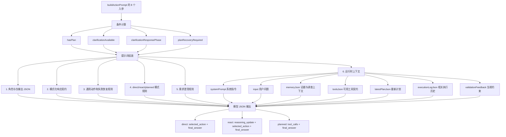
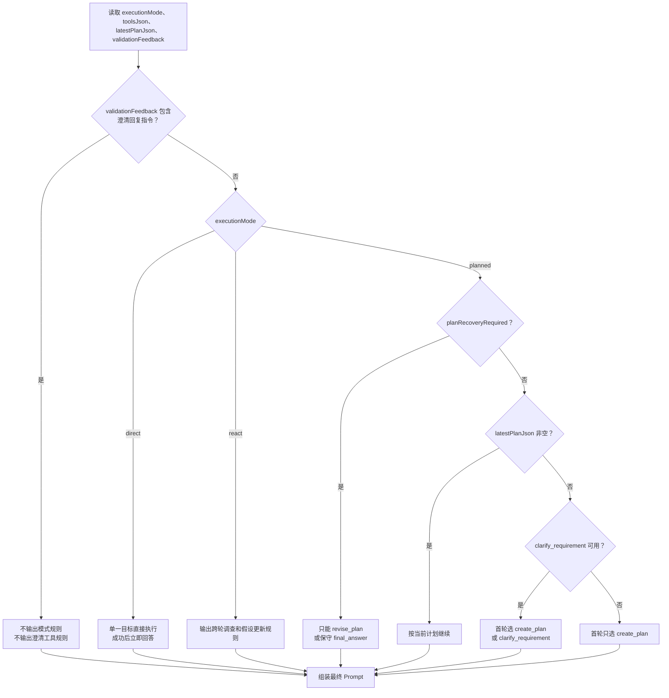
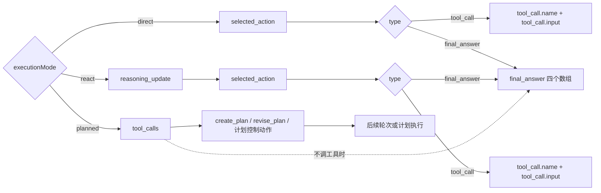
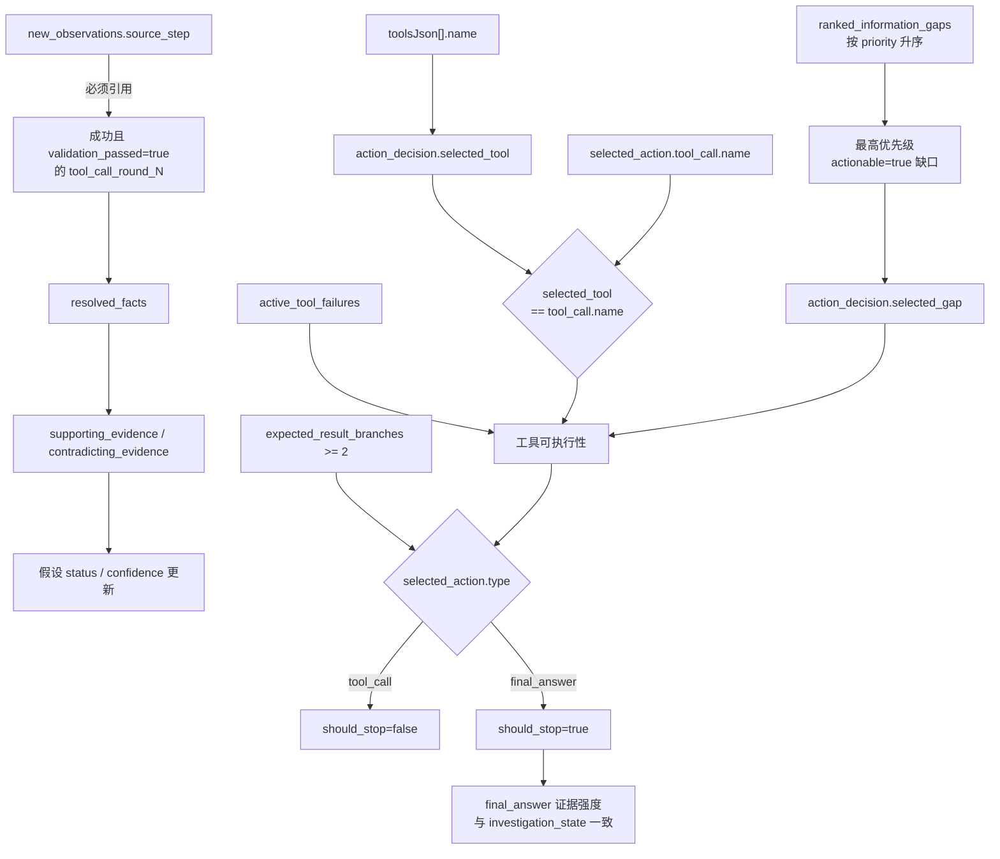
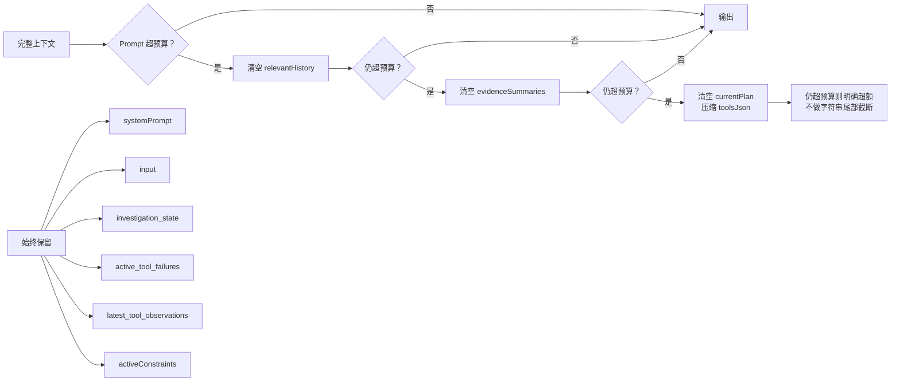
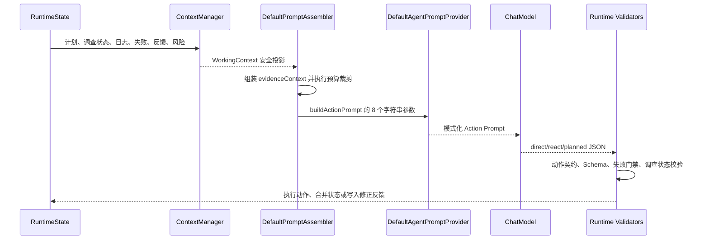

# `DefaultAgentPromptProvider#buildActionPrompt` 系统提示词结构说明

## 1. 文档范围

本文档对应当前代码中的 `com.agent.javascope.prompt.DefaultAgentPromptProvider#buildActionPrompt`，说明：

- 提示词由哪些大区域组成。
- Java 方法的全部输入参数如何映射到提示词。
- 每个 JSON 上下文区域的字段含义。
- `direct`、`react` 和 `planned` 三种模式的完整输出字段。
- 条件分支、字段之间的一致性约束和预算裁剪规则。

> 注：本方法生成的是 Action 决策阶段的基础提示词。实际运行时，`LayeredAgentPromptProvider` 还可以在该文本之后追加业务定制规则。

## 2. 整体结构图



## 3. 生成后提示词的大部分

| 顺序 | 大部分 | 作用 |
|---|---|---|
| 1 | 角色和输出边界 | 把模型限定为“系统级任务控制器”，要求仅输出 JSON。 |
| 2 | 响应契约 | 按 `executionMode` 插入 direct、react 或 planned 的 JSON 外形。 |
| 3 | 通用规则 | 定义单轮动作、Schema 约束、工具失败恢复、结论可追溯等全模式共用规则。 |
| 4 | 单动作协议 | direct/react 使用 `selected_action`；planned 使用 `tool_calls`。 |
| 5 | 模式规则 | 根据模式、是否有计划、是否处于计划恢复阶段动态生成。 |
| 6 | 澄清规则 | 只在 `clarify_requirement` 可用且当前不是澄清回复阶段时出现。 |
| 7 | 运行时上下文 | 注入系统指令、用户问题、证据、工具、计划、历史和当前约束。 |

## 4. Java 方法输入字段

### 4.1 顶层入参

```java
buildActionPrompt(
    String systemPrompt,
    String input,
    String executionMode,
    String memoryJson,
    String toolsJson,
    String latestPlanJson,
    String executionLogJson,
    String validationFeedback)
```

| 参数 | 提示词中的标题 | 含义 | 当前实际来源 |
|---|---|---|---|
| `systemPrompt` | `系统提示` | Agent 级别的角色、安全和全局行为指令。 | `Agent.systemInstruction` |
| `input` | `用户问题` | 当前任务的原始用户输入。 | 执行策略的当前输入 |
| `executionMode` | `当前执行模式` | `direct`、`react` 或 `planned`，决定响应契约和模式规则。 | 路由结果 |
| `memoryJson` | `关键证据与最新工具观察` | 名称保留了 memory，但当前实际是一个结构化的证据上下文对象。 | `DefaultPromptAssembler` 组装的 `evidenceContext` |
| `toolsJson` | `可用工具` | 当前轮次允许模型选择的工具及其契约。 | 可见工具定义列表 |
| `latestPlanJson` | `最新计划` | 当前生效计划；空对象或空数组表示尚无计划。 | `WorkingContext.currentPlan` |
| `executionLogJson` | `相关执行历史` | 经上下文管理器选取的相关日志，不一定是全量日志。 | `WorkingContext.relevantHistory` |
| `validationFeedback` | `当前约束与校验反馈` | 参数名看似只是文本反馈，但当前实际传入的是整个活跃约束 JSON 数组。 | `WorkingContext.activeConstraints` |

### 4.2 `memoryJson` 完整结构

```json
{
  "investigation_state": {},
  "active_tool_failures": [],
  "latest_tool_observations": [],
  "evidence_summaries": []
}
```

#### 4.2.1 `investigation_state`

`investigation_state` 是 ReAct 跨轮保留的可审计调查状态，不是模型隐藏思维链。

| 字段 | 类型 | 含义 |
|---|---|---|
| `question_frame` | object | 当前调查问题的稳定口径。 |
| `question_frame.target` | string | 调查对象。 |
| `question_frame.phenomenon` | string | 需要解释、核验或判断的现象。 |
| `question_frame.time_window` | string | 调查时间范围；未知时为 `unknown`。 |
| `question_frame.benchmark` | string | 比较基准；不适用时为 `none`。 |
| `resolved_facts` | array | 已通过有效工具步骤确认的事实。 |
| `resolved_facts[].source_step` | string | 事实来源，必须对应成功的 `tool_call_round_N`。 |
| `resolved_facts[].fact` | string | 工具结果直接支持的事实。 |
| `resolved_facts[].reliability` | string | `high`、`medium` 或 `low`。 |
| `resolved_facts[].relevance` | string | 该事实对假设或问题的区分价值。 |
| `hypotheses` | array | 跨轮维护的候选解释或判断。 |
| `hypotheses[].hypothesis_id` | string | 假设稳定 ID，例如 `H1`。 |
| `hypotheses[].claim` | string | 假设内容。 |
| `hypotheses[].status` | string | `open`、`supported`、`weakened` 或 `rejected`。 |
| `hypotheses[].confidence` | number | 0 到 1 之间的置信度。 |
| `hypotheses[].supporting_evidence` | string[] | 支持证据的 `source_step` 列表。 |
| `hypotheses[].contradicting_evidence` | string[] | 反对证据的 `source_step` 列表。 |
| `hypotheses[].missing_evidence` | string[] | 仍然缺少的证据。 |
| `hypotheses[].last_update_reason` | string | 最近一次更新或保持不变的原因；对应模型输出中的 `update_reason`。 |
| `open_questions` | array | 尚未解决且已排序的信息缺口。 |
| `open_questions[].gap` | string | 信息缺口。 |
| `open_questions[].priority` | number | 排序值，越小越优先。 |
| `open_questions[].actionable` | boolean | 当前是否有可用工具和必要输入来解决。 |
| `open_questions[].blocked_reason` | string | 不可执行时的原因；可执行时为空。 |
| `open_questions[].reason` | string | 该缺口能区分候选假设的原因。 |
| `contradiction_check` | string[] | 当前主判断面临的反证或未排除解释。 |
| `last_action_decision` | object | 上一次通过校验的动作决策。 |
| `last_action_decision.selected_gap` | string | 当时选择解决的信息缺口。 |
| `last_action_decision.selected_tool` | string | 当时选择的工具。 |
| `last_action_decision.why_now` | string | 为何当时优先执行该动作。 |
| `last_action_decision.expected_result_branches` | array | 不同工具结果对假设的预期影响。 |
| `last_action_decision.expected_result_branches[].if` | string | 预期的工具结果分支。 |
| `last_action_decision.expected_result_branches[].then` | string | 该分支出现后如何更新判断。 |
| `stop_assessment` | object | 上一轮停止条件评估。 |
| `stop_assessment.should_stop` | boolean | 证据是否已足以停止调查。 |
| `stop_assessment.reason` | string | 继续或停止的原因。 |
| `last_updated_round` | integer | 最近一次有效合并的推理轮次。 |

#### 4.2.2 `active_tool_failures`

| 字段 | 类型 | 含义 |
|---|---|---|
| `failure_id` | string | 当前任务内稳定的失败 ID。 |
| `round` | integer | 失败发生的推理轮次。 |
| `source_step` | string | 产生失败的执行步骤。 |
| `tool_name` | string | 失败工具名。 |
| `input_fingerprint` | string | `tool+input` 的稳定指纹。 |
| `category` | string | 跨工具错误分类。 |
| `code` | string | 稳定错误码。 |
| `public_message` | string | 可安全进入 Prompt 和用户回复的错误信息。 |
| `recovery_owner` | string | 恢复责任主体，例如 `SYSTEM`、`MODEL`、`USER` 或 `DEVELOPER`。 |
| `allowed_actions` | string[] | 当前错误允许的后续恢复动作。 |
| `retryable` | boolean | 错误在能力上是否可重试，不等于允许模型立即重试。 |
| `retry_after_ms` | integer/null | 依赖方建议的重试等待时间；可选。 |
| `attempt_count` | integer | 中间件完成后的总尝试次数。 |
| `final_failure` | boolean | 是否已经形成最终失败。 |
| `blocked_same_call` | boolean | 是否禁止原样重放相同 `tool+input`。 |

#### 4.2.3 `latest_tool_observations[]`

每个工具只保留最新一次观察，且字段会经过 Prompt 安全投影。

| 字段 | 类型 | 出现条件与含义 |
|---|---|---|
| `source_step` | string | 对应日志步骤，例如 `tool_call_round_3`。 |
| `tool_name` | string | 工具名。 |
| `status` | string | 工具执行状态，通常为 `success` 或 `failed`。 |
| `retryable` | boolean | 顶层兼容性重试标记。 |
| `error_code` | string | 非空时出现的兼容性错误码。 |
| `error` | object | 存在结构化错误时出现。 |
| `error.category` | string | 错误分类。 |
| `error.code` | string | 稳定错误码。 |
| `error.public_message` | string | 公开错误说明。 |
| `error.recovery_owner` | string | 恢复责任方。 |
| `error.allowed_actions` | string[] | 允许的恢复动作。 |
| `error.retryable` | boolean | 错误的可重试属性。 |
| `attempt` | object | metadata 中存在 `attempt_count` 时出现。 |
| `attempt.attempt_count` | integer | 已尝试次数。 |
| `attempt.max_attempts` | integer | 最大尝试次数。 |
| `attempt.retry_exhausted` | boolean | 系统重试是否已用尽。 |
| `attempt.retry_skipped` | boolean | 系统重试是否被跳过。 |
| `input` | object/any | 经压缩的工具输入。 |
| `key_data` | object/any | 仅在 `status=success` 且 `validation_passed=true` 时出现；是经压缩的工具 `data`。 |
| `errors` | array | 无结构化 `error` 时，由 `validation_errors` 投影的兼容错误列表。 |

#### 4.2.4 `evidence_summaries[]`

`evidence_summaries` 有两种元素：

| 元素类型 | 字段 | 含义 |
|---|---|---|
| 业务决策 | `type="business_decision"` | 声明该项是业务工具上报的决策状态。 |
| 业务决策 | `decision` | 业务决策的通用 JSON，具体字段由业务工具自定义。 |
| 工具证据 | 与 `latest_tool_observations[]` 相同 | 从相关执行历史构建的工具观察摘要。 |

### 4.3 `toolsJson[]` 工具定义字段

| 字段 | 类型 | 含义 |
|---|---|---|
| `name` | string | 工具唯一名称，必须与模型输出的工具名一致。 |
| `title` | string | 工具短标题。 |
| `description` | string | 工具用途、适用场景和边界。 |
| `namespace` | string | 工具命名空间。 |
| `category` | string | 工具细分类。 |
| `version` | string | 工具契约版本。 |
| `tags` | string[] | 检索、过滤和策略匹配标签。 |
| `tool_type` | string | 系统流程工具或业务执行工具。 |
| `visibility` | string | 可见性；只有当前可见工具会进入列表。 |
| `danger_level` | string | 工具风险级别。 |
| `read_only` | boolean | 是否只读。 |
| `idempotent` | boolean | 是否幂等。 |
| `requires_confirmation` | boolean | 是否需要用户确认。 |
| `allowed_direct_call` | boolean | 是否允许模型直接调用。 |
| `allowed_in_plan_step` | boolean | 是否允许出现在计划步骤中。 |
| `timeout_ms` | integer | 建议超时时间，单位毫秒。 |
| `input_schema` | object | 工具输入 JSON Schema；其 `type`、`properties`、`required`、`items`、`enum` 等字段由具体工具决定。 |
| `output_schema` | object | 工具输出 JSON Schema；模型只能依赖其声明的字段。 |
| `strict_output_contract` | boolean | 是否由业务工具显式声明严格输出 Schema。 |
| `examples` | object[] | 工具调用示例。 |

Prompt 超预算时，工具定义可被压缩为仅保留 `name`、`tool_type` 和 `input_schema`。

### 4.4 `latestPlanJson[]` 计划步骤字段

| 字段 | 类型 | 含义 |
|---|---|---|
| `step_id` | string | 稳定且唯一的计划步骤 ID。 |
| `name` | string | 步骤名称。 |
| `description` | string | 步骤详细说明。 |
| `tool` | string | 当前步骤调用的工具名。 |
| `input` | object | 工具输入，字段由该工具 `input_schema` 决定。 |
| `expected_outcome` | string | 人类可读的期望产出。 |
| `required_outputs` | array | 机器可校验的必需输出。 |
| `required_outputs[].path` | string | 相对于工具完整返回值的 JSON 路径。 |
| `required_outputs[].type` | string | `string`、`number`、`boolean`、`object`、`array` 或 `any`。 |
| `required_outputs[].nullable` | boolean | 字段存在时是否允许值为 `null`。 |
| `required_outputs[].expected_value` | any | 可选固定期望值；不设置时只校验存在性和类型。 |
| `depends_on_previous` | boolean | 是否必须依赖紧邻的上一步。 |
| `depends_on_step_ids` | string[] | 显式依赖的多个前序步骤 ID。 |

### 4.5 `executionLogJson[]` 执行日志字段

| 字段 | 类型 | 含义 |
|---|---|---|
| `step` | string | 日志步骤 ID，例如 `reasoning_round_1` 或 `tool_call_round_1`。 |
| `tool_name` | string | 工具名或内部阶段名。 |
| `input` | any | 该日志步骤的输入。 |
| `output` | any | 该日志步骤的输出。 |
| `confidence` | number | 日志结果置信度。 |

工具日志的 `output` 通常使用下列 Envelope：

| 字段 | 类型 | 含义 |
|---|---|---|
| `tool` | string | 返回所属工具。 |
| `status` | string | `success` 或 `failed`。 |
| `validation_passed` | boolean | 是否通过输出契约和语义校验。 |
| `validation_rules` | string[] | 已应用的校验规则。 |
| `validation_errors` | string[] | 兼容协议的错误摘要。 |
| `retryable` | boolean | 兼容协议的可重试标记。 |
| `error_code` | string | 兼容协议的错误码。 |
| `data` | any | 成功业务数据；失败时可能只供审计。 |
| `metadata` | object | 调用、重试和 Trace 元数据。 |
| `error` | object/null | 失败时的结构化错误；包含 `category`、`code`、`public_message`、`recovery_owner`、`allowed_actions`、`retryable`、`retry_after_ms`。内部异常字段不进入 Prompt 安全投影。 |

### 4.6 `validationFeedback` / 当前约束

当前传入值是 JSON 数组，元素可来自：

- 最近一次校验或执行失败的修正反馈。
- 仅供下一轮使用的 `ephemeralMemory`。
- 当前执行累积的 `riskFlags`。

方法内部会对该字符串做关键片段检查，因此它同时参与控制流分支。

## 5. 条件生成逻辑



### 5.1 四个内部条件

| 条件 | 判定方式 | 影响 |
|---|---|---|
| `hasPlan` | `latestPlanJson` 不是空、`null`、`{}` 或 `[]` | 决定 planned 是创建计划还是继续计划。 |
| `clarificationAvailable` | `toolsJson` 包含 `"clarify_requirement"` | 决定是否注入需求澄清规则。 |
| `clarificationResponsePhase` | `validationFeedback` 包含“不要调用任何工具，仅输出 final_answer” | 清空模式规则和澄清工具规则。 |
| `planRecoveryRequired` | `validationFeedback` 包含 `plan_recovery_required`、“只能调用 revise_plan”或“工具动作只能是 revise_plan” | 将 planned 限制为修订计划或保守结束。 |

## 6. 通用规则的语义

| 规则组 | 含义 |
|---|---|
| 二选一 | 每轮只能选择工具动作或 `final_answer`，不得同时执行。 |
| 契约约束 | 工具名和输入必须符合 `input_schema`；只能依赖 `output_schema` 声明且已校验通过的输出。 |
| 失败事实 | `active_tool_failures` 是恢复约束的权威来源，`latest_tool_observations.error` 是最近错误事实。 |
| 同参阻断 | `blocked_same_call=true` 时不得重放原 `tool+input`。 |
| 工具级阻断 | 依赖不可用或熔断失败未解除前，不得只更换参数后重试同一工具。 |
| 恢复权限 | 模型不得模拟 `recovery_owner=SYSTEM` 的重试；只能从 `allowed_actions` 选可执行动作。 |
| 无需执行 | 如果当前输入其实不需要任务执行，直接回答而不调用工具。 |
| 优先级 | “当前约束与校验反馈”优先于普通历史。 |
| 可追溯 | 最终结论必须能追溯到相关执行历史和有效观察。 |

### 6.1 需求澄清规则

当 `clarify_requirement` 在可用工具中，且当前不是澄清文案回复阶段时，Prompt 追加以下语义：

| 规则 | 含义 |
|---|---|
| 只澄清真正分支 | 只有无法从上下文、惯例或安全默认中消解的业务语义或授权问题才可澄清。 |
| 不澄清技术适配 | 参数抽取、格式、编码、Schema 适配、工具失败、证据不足和能力限制不属于需求澄清。 |
| 先使用可披露默认 | 同义表达和可确定的语义映射不是不同业务分支；可安全默认时直接执行并披露默认值。 |
| 运行时澄清门槛 | 只有新证据产生会导致实质不同结果、且必须由用户决定的分支时才能再澄清。 |

## 7. 模型输出契约

### 7.1 三模式分支图



### 7.2 direct 输出字段

```json
{
  "selected_action": {
    "type": "tool_call|final_answer",
    "tool_call": {
      "name": "",
      "input": {}
    }
  },
  "final_answer": {
    "core_conclusions": [],
    "key_evidence": [],
    "risk_points": [],
    "next_actions": []
  }
}
```

| 字段 | 类型 | 含义 |
|---|---|---|
| `selected_action` | object | 本轮唯一动作。 |
| `selected_action.type` | string | `tool_call` 或 `final_answer`。 |
| `selected_action.tool_call` | object | `type=tool_call` 时的工具动作。 |
| `selected_action.tool_call.name` | string | 必须来自 `toolsJson[].name`。 |
| `selected_action.tool_call.input` | object | 必须符合该工具 `input_schema`。 |
| `final_answer` | object | `type=final_answer` 时的用户面向结果；调工具时不应同时产生实质答案。 |
| `final_answer.core_conclusions` | array | 核心结论。 |
| `final_answer.key_evidence` | array | 支撑结论的关键证据。 |
| `final_answer.risk_points` | array | 不确定性、限制和风险。 |
| `final_answer.next_actions` | array | 建议的后续动作。 |

### 7.3 react 输出字段

React 比 direct 多一个必填的 `reasoning_update`，用来更新可审计的调查状态。

```json
{
  "reasoning_update": {
    "question_frame": {
      "target": "",
      "phenomenon": "",
      "time_window": "unknown",
      "benchmark": "none"
    },
    "new_observations": [
      {
        "source_step": "tool_call_round_N",
        "fact": "",
        "reliability": "high|medium|low",
        "relevance": ""
      }
    ],
    "hypothesis_updates": [
      {
        "hypothesis_id": "H1",
        "claim": "",
        "status": "open|supported|weakened|rejected",
        "confidence": 0.0,
        "supporting_evidence": [],
        "contradicting_evidence": [],
        "missing_evidence": [],
        "update_reason": ""
      }
    ],
    "contradiction_check": [],
    "ranked_information_gaps": [
      {
        "gap": "",
        "priority": 1,
        "actionable": true,
        "blocked_reason": "",
        "reason": ""
      }
    ],
    "action_decision": {
      "selected_gap": "",
      "selected_tool": "",
      "why_now": "",
      "expected_result_branches": [
        {"if": "", "then": ""},
        {"if": "", "then": ""}
      ]
    },
    "stop_assessment": {
      "should_stop": false,
      "reason": ""
    }
  },
  "selected_action": {
    "type": "tool_call|final_answer",
    "tool_call": {"name": "", "input": {}}
  },
  "final_answer": {
    "core_conclusions": [],
    "key_evidence": [],
    "risk_points": [],
    "next_actions": []
  }
}
```

#### `reasoning_update` 字段

| 字段 | 类型 | 含义与校验要求 |
|---|---|---|
| `question_frame` | object | 当前问题口径。 |
| `question_frame.target` | string | 必须非空；调查对象。 |
| `question_frame.phenomenon` | string | 必须非空；需解释或判断的现象。 |
| `question_frame.time_window` | string | 时间范围；未知时明确为 `unknown`。 |
| `question_frame.benchmark` | string | 比较基准；不适用时为 `none`。 |
| `new_observations` | array | 本轮新增事实；首轮必须为空数组。 |
| `new_observations[].source_step` | string | 必须是真实存在且校验成功的 `tool_call_round_N`。 |
| `new_observations[].fact` | string | 工具结果直接支持的事实，不能写推测。 |
| `new_observations[].reliability` | string | `high`、`medium` 或 `low`。 |
| `new_observations[].relevance` | string | 该事实支持、削弱或区分什么。 |
| `hypothesis_updates` | array | 本轮假设更新；不能为空，无变化时也要说明原因。 |
| `hypothesis_updates[].hypothesis_id` | string | 跨轮稳定 ID；首轮至少建立两个可区分假设。 |
| `hypothesis_updates[].claim` | string | 候选解释；新假设必填。 |
| `hypothesis_updates[].status` | string | `open`、`supported`、`weakened` 或 `rejected`。 |
| `hypothesis_updates[].confidence` | number | 0 到 1。 |
| `hypothesis_updates[].supporting_evidence` | string[] | 支持证据的纯 `source_step`。 |
| `hypothesis_updates[].contradicting_evidence` | string[] | 反对证据的纯 `source_step`。 |
| `hypothesis_updates[].missing_evidence` | string[] | 仍缺少的证据。 |
| `hypothesis_updates[].update_reason` | string | 本轮更新或保持不变的依据。 |
| `contradiction_check` | string[] | 反证或未排除的替代解释；首轮无证据时可为空。 |
| `ranked_information_gaps` | array | 按信息价值排序的未决缺口。 |
| `ranked_information_gaps[].gap` | string | 缺口内容。 |
| `ranked_information_gaps[].priority` | number | 优先级，数字越小越优先。 |
| `ranked_information_gaps[].actionable` | boolean | 当前是否可执行。 |
| `ranked_information_gaps[].blocked_reason` | string | `actionable=false` 时必填；可执行时为空。 |
| `ranked_information_gaps[].reason` | string | 为何该缺口有区分价值。 |
| `action_decision` | object | 本轮动作的可审计决策摘要。 |
| `action_decision.selected_gap` | string | 调工具时必须是 `priority` 最小的 `actionable=true` 缺口；结束时可空。 |
| `action_decision.selected_tool` | string | 调工具时必须与 `selected_action.tool_call.name` 完全一致；结束时可空。 |
| `action_decision.why_now` | string | 调工具时必填；说明为何本轮优先解决该缺口。 |
| `action_decision.expected_result_branches` | array | 调工具时至少两个可区分结果分支。 |
| `action_decision.expected_result_branches[].if` | string | 某一可观察结果。 |
| `action_decision.expected_result_branches[].then` | string | 结果出现后如何更新哪些假设。 |
| `stop_assessment` | object | 是否应停止调查。 |
| `stop_assessment.should_stop` | boolean | `tool_call` 时必须为 `false`；`final_answer` 时必须为 `true`。 |
| `stop_assessment.reason` | string | 必须非空；解释证据是否足够。 |

`selected_action` 和 `final_answer` 的字段含义与 direct 模式相同。

### 7.4 planned 输出字段

```json
{
  "tool_calls": [
    {
      "name": "",
      "input": {}
    }
  ],
  "final_answer": {
    "core_conclusions": [],
    "key_evidence": [],
    "risk_points": [],
    "next_actions": []
  }
}
```

| 字段 | 类型 | 含义 |
|---|---|---|
| `tool_calls` | array | planned 模式的控制动作列表。Action Prompt 要求本轮只选一个控制动作；多步计划由 `create_plan` 或 `revise_plan` 的入参载荷表达。 |
| `tool_calls[].name` | string | 工具名，首轮通常是 `create_plan`、`clarify_requirement`，恢复时是 `revise_plan`。 |
| `tool_calls[].input` | object | 该控制工具的输入，必须符合 `input_schema`。 |
| `final_answer` | object | 不再调用控制工具时的最终答案。 |
| `final_answer.core_conclusions` | array | 核心结论。 |
| `final_answer.key_evidence` | array | 关键证据。 |
| `final_answer.risk_points` | array | 风险和限制。 |
| `final_answer.next_actions` | array | 后续建议。 |

## 8. React 字段间的核心约束图



## 9. Prompt 预算裁剪与保留优先级

`buildActionPrompt` 本身只负责渲染，它的上游 `DefaultPromptAssembler` 负责预算裁剪。



## 10. 一轮 Action 决策的数据流



## 11. 当前实现中需特别注意的命名

1. `memoryJson` 已不是普通“记忆文本”，而是包含调查状态、活跃失败、最新观察和证据摘要的结构化 JSON。
2. `validationFeedback` 当前实际接收整个 `activeConstraints` JSON 数组，不只是单一校验文本。
3. `executionLogJson` 实际是预算内的“相关历史”，而非完整执行轨迹；全量轨迹仍在 Runtime 中保留。
4. `final_answer` 在三种响应模板中都存在，但“工具动作”和“最终答案”必须二选一，不得同时输出实质内容。

## 12. 对应源码

- `javascope-agent-core/src/main/java/com/agent/javascope/prompt/DefaultAgentPromptProvider.java`
- `javascope-agent-core/src/main/java/com/agent/javascope/agent/prompt/DefaultPromptAssembler.java`
- `javascope-agent-context/src/main/java/com/agent/javascope/context/projection/InMemoryContextManager.java`
- `javascope-agent-context/src/main/java/com/agent/javascope/context/projection/WorkingContext.java`
- `javascope-agent-core/src/main/java/com/agent/javascope/agent/runtime/InvestigationStateTracker.java`
- `javascope-agent-core/src/main/java/com/agent/javascope/agent/runtime/ToolFailureRecord.java`
- `javascope-agent-spi/src/main/java/com/agent/javascope/contract/tool/AgentToolDefinition.java`
- `javascope-agent-spi/src/main/java/com/agent/javascope/contract/plan/PlanStepDefinition.java`
- `javascope-agent-core/src/main/java/com/agent/javascope/entity/execution/AgentExecutionLogEntry.java`
