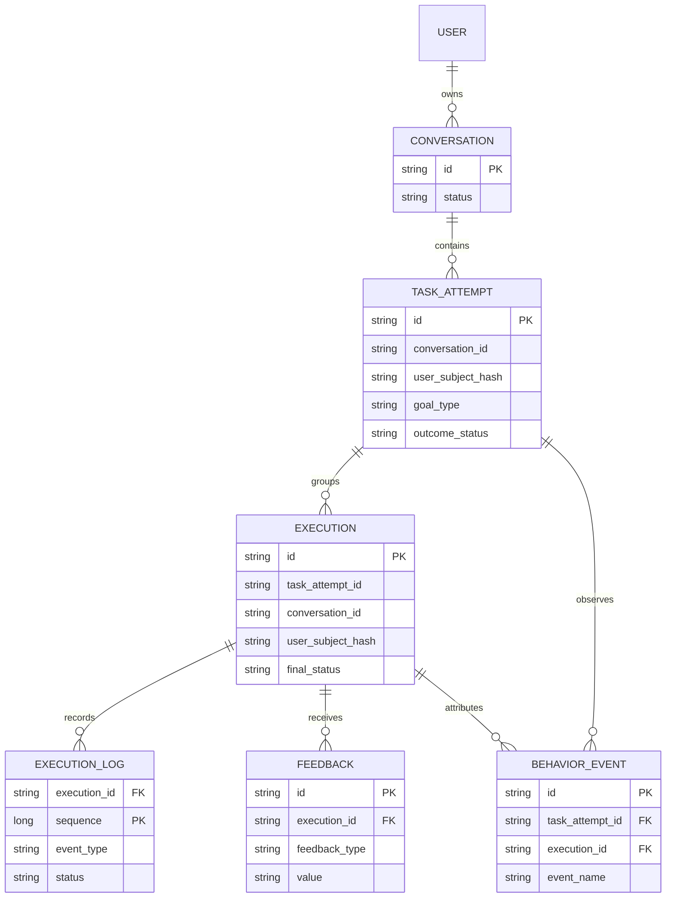

# 上线后用户使用数据与产品迭代闭环方案

## 1. 目标与范围

本方案用于在产品上线后回答三个问题：

1. 用户是否完成了本次目标？
2. 未完成时，问题发生在产品流程、数据源、Agent 执行还是答案呈现？
3. 哪类问题最值得优先修复，并且修复后是否真实改善？

首期不采集完整 Prompt、模型原始响应、模型私有推理文本、工具原始输入输出，也不把用户原始问题写入长期执行日志。采集重点是：可审计的框架执行摘要、用户显式反馈和可解释的产品行为事件。

## 2. 核心原则

- **一次用户提交对应一次 execution。** `execution_id` 是框架执行流程的主键。
- **一次用户目标对应一次 task_attempt。** 用户可围绕同一目标多次追问；这些 execution 归入同一个任务尝试，才能判断目的是否最终达成。
- **执行日志只追加，不更新、不提供业务删除接口。** 日志用于质量、稳定性和审计，不随用户在界面删除对话而删除。
- **对话内容与审计日志分离。** 用户删除的是可见会话和消息内容；审计日志只保留不可逆关联标识及结构化摘要。
- **显式反馈优先，隐式行为辅助。** 不将“没有继续提问”直接等同于“目的已达成”。
- **维度低基数、内容最小化。** 用稳定枚举、错误码和版本号分析；不把股票代码、自由文本、异常堆栈作为 Prometheus 标签。

## 3. 数据关联关系



`conversation_id` 仅用于内部关联；`user_subject_hash` 为服务端使用密钥计算的不可逆 HMAC 值，不能由数据库中的值反推出用户 ID。数据分析只使用该哈希值，不使用登录名、手机号或其他直接标识符。

## 4. 采集的数据与结构

### 4.1 `task_attempt`：一次用户目标

在用户首次提交一个目标时创建。连续追问若仍服务同一目标，则复用该记录；用户切换股票、切换分析意图、主动新建对话或超过 30 分钟无交互后，创建新的任务尝试。

| 字段 | 类型 | 含义 |
| --- | --- | --- |
| `id` | VARCHAR(64), PK | 任务尝试 ID |
| `conversation_id` | VARCHAR(64) | 会话关联；无外键级联删除 |
| `user_subject_hash` | CHAR(64) | 不可逆用户关联标识 |
| `business_code` | VARCHAR(32) | 例如 `stock` |
| `goal_type` | VARCHAR(32) | 初始为 `unknown`，后续归类为行情查询、财报分析、估值、风险、比较等 |
| `started_at` / `last_active_at` | DATETIME(3) | 开始与最近活动时间 |
| `outcome_status` | VARCHAR(24) | `unknown`、`achieved`、`partially_achieved`、`not_achieved`、`abandoned` |
| `outcome_source` | VARCHAR(24) | `explicit`、`inferred`、`none` |
| `outcome_recorded_at` | DATETIME(3) | 最终结果记录时间 |

`outcome_status` 以用户显式反馈为最高优先级；仅在没有显式反馈且满足预先定义的规则时，才允许写入 `inferred` 推断值。

### 4.2 `execution`：一次框架处理摘要

用户每次提交消息时创建。该表用于按模型、Prompt 版本、执行模式和最终状态定位问题，不存用户输入和模型原文。

| 字段 | 类型 | 含义 |
| --- | --- | --- |
| `id` | VARCHAR(64), PK | 即 `execution_id` |
| `task_attempt_id` | VARCHAR(64) | 所属用户目标 |
| `conversation_id` | VARCHAR(64) | 会话关联；无外键级联删除 |
| `user_subject_hash` | CHAR(64) | 去标识化用户关联 |
| `request_kind` | VARCHAR(16) | `chat`、`meta`、`task` |
| `execution_mode` | VARCHAR(16) | `direct`、`planned`、`react`、`none` |
| `model_provider` / `model_name` | VARCHAR(64) | 实际模型版本 |
| `prompt_version` | VARCHAR(64) | 业务 Prompt/规则版本 |
| `final_status` | VARCHAR(24) | `completed`、`partial`、`failed`、`clarification_required`、`cancelled` |
| `failure_code` | VARCHAR(64), NULL | 最终稳定错误码，不存异常文本 |
| `started_at` / `finished_at` | DATETIME(3) | 执行边界 |
| `total_latency_ms` | BIGINT | 总耗时 |
| `round_count` | INT | Agent Action/Observation 轮数 |
| `tool_call_count` / `tool_failure_count` | INT | 工具调用与最终失败数量 |
| `answer_evidence_level` | VARCHAR(16) | `sufficient`、`partial`、`insufficient`、`not_applicable` |

建议索引：`(started_at)`、`(final_status, started_at)`、`(task_attempt_id, started_at)`、`(model_name, prompt_version, started_at)`。

### 4.3 `execution_log`：不可变框架流程事件

每次 `ExecutionTrace` 仅写入已脱敏的事件摘要。主键为 `(execution_id, sequence)`，按序号可回放流程，但不可回放用户内容或模型原文。

| 字段 | 类型 | 含义 |
| --- | --- | --- |
| `execution_id` | VARCHAR(64) | 所属执行 |
| `sequence` | BIGINT | 同一次执行内单调递增序号 |
| `occurred_at` | DATETIME(3) | 事件发生时间 |
| `event_type` | VARCHAR(48) | 见下方事件字典 |
| `status` | VARCHAR(16), NULL | `started`、`success`、`failed`、`skipped` |
| `step_index` / `round_index` | INT, NULL | 计划步骤和 Agent 轮次 |
| `tool_name` | VARCHAR(96), NULL | 业务工具稳定名称 |
| `error_category` / `error_code` | VARCHAR(48/64), NULL | 分类与稳定错误码 |
| `latency_ms` | BIGINT, NULL | 当前事件耗时 |
| `retry_count` | INT, NOT NULL | 本事件已重试次数 |
| `source_name` | VARCHAR(64), NULL | 数据源，例如 `sina`、`eastmoney` |
| `summary_json` | JSON | 仅允许白名单字段的结构化摘要 |

允许的 `summary_json` 示例：

```json
{
  "plan_step_count": 4,
  "required_slots_resolved": ["symbol", "report_period"],
  "result_quality": "partial",
  "recovery_action": "fallback_source"
}
```

禁止写入：用户消息、完整 Prompt、模型响应、思维链、工具原始参数、工具原始结果、Cookie、Token、堆栈、数据库连接信息。

建议事件字典：

| `event_type` | 写入时机 | 必填摘要 |
| --- | --- | --- |
| `REQUEST_STARTED` | 创建执行 | `request_kind` |
| `ROUTE_DECIDED` | 路由完成 | `request_kind`、`execution_mode` |
| `PLAN_CREATED` / `PLAN_REVISED` | 计划确定或修订 | 步骤数、原因码 |
| `TOOL_STARTED` | 工具开始 | `tool_name`、步骤号、轮次 |
| `TOOL_COMPLETED` | 工具成功/失败 | 状态、耗时、重试、错误码、数据源、结果质量 |
| `CLARIFICATION_REQUIRED` | 必须向用户补充信息 | 缺失槽位名，不存原句 |
| `ANSWER_VALIDATED` | 最终答案校验 | 状态、规则码、证据等级 |
| `EXECUTION_FINISHED` | 执行结束 | `final_status`、总耗时、轮数 |

### 4.4 `feedback`：显式用户反馈

反馈不与原始答案文本绑定，只绑定 `execution_id`。一次执行的同类反馈只保留用户最后一次选择，并额外记录修改事件用于审计。

| 字段 | 类型 | 含义 |
| --- | --- | --- |
| `id` | VARCHAR(64), PK | 反馈 ID |
| `execution_id` | VARCHAR(64) | 反馈对应的执行 |
| `task_attempt_id` | VARCHAR(64) | 方便汇总目标结果 |
| `feedback_type` | VARCHAR(32) | `answer_helpfulness`、`goal_achievement`、`failure_reason` |
| `value` | VARCHAR(32) | 枚举值，见下方 |
| `created_at` / `updated_at` | DATETIME(3) | 提交与修改时间 |

枚举：

- `answer_helpfulness`：`helpful`、`not_helpful`
- `goal_achievement`：`achieved`、`partially_achieved`、`not_achieved`
- `failure_reason`：`misunderstood_request`、`insufficient_conclusion`、`insufficient_analysis`、`insufficient_personalization`、`data_incomplete`、`data_quality_issue`、`insufficient_evidence`、`missing_next_step`、`missing_capability`、`slow_or_failed`、`different_goal`

首期不提供自由文本反馈；需要补充开放反馈时，应单独征得用户同意、限长、脱敏并设置更短的保留期。

### 4.5 `behavior_event`：隐式行为事件

只记录产品行为，不记录页面输入内容。事件采用追加写入，客户端事件必须带 `event_id` 幂等去重。

| 字段 | 类型 | 含义 |
| --- | --- | --- |
| `id` | VARCHAR(64), PK | 事件 ID |
| `occurred_at` | DATETIME(3) | 行为时间 |
| `user_subject_hash` | CHAR(64) | 去标识化用户关联 |
| `task_attempt_id` | VARCHAR(64), NULL | 所属目标 |
| `execution_id` | VARCHAR(64), NULL | 归因到的回答 |
| `event_name` | VARCHAR(48) | 标准行为名称 |
| `properties_json` | JSON | 白名单属性，例如停留秒数、入口位置 |

首期事件：`answer_rendered`、`answer_feedback_opened`、`feedback_submitted`、`evidence_viewed`、`answer_copied`、`answer_saved`、`follow_up_submitted`、`conversation_deleted`、`execution_abandoned`。

`conversation_deleted` 只记录界面删除行为和时间；不删除、也不改变关联的 `execution` 与 `execution_log`。

## 5. 删除、保留与访问规则

### 5.1 用户删除对话

用户删除对话时：

1. 将 `conversation.status` 标记为 `deleted`，从用户列表和普通查询中隐藏。
2. 删除或按产品策略清除 `conversation_message` 中可识别的消息内容。
3. 不删除 `task_attempt`、`execution`、`execution_log`、`feedback`、`behavior_event`。
4. 不对执行审计表建立 `ON DELETE CASCADE` 外键。

### 5.2 保留期限

建议首期策略：

| 数据 | 建议保留期 | 说明 |
| --- | --- | --- |
| 可见对话和消息 | 用户删除后立即隐藏；内容按产品政策清除 | 面向用户的记录 |
| `execution_log`、`execution` | 180 天 | 质量、稳定性和审计分析 |
| `feedback`、`behavior_event` | 180 天 | 评估结果与产品使用漏斗 |
| 日/周聚合指标 | 24 个月 | 不含可关联用户的明细 |

在隐私政策中明确：用户删除的是可见对话内容；去标识化的系统运行与质量日志会在固定期限内保留。若适用法律或用户的删除请求要求更高标准，应优先遵从并将关联标识匿名化，而不是无限期保留可关联个人的数据。

### 5.3 访问控制

- 运营看聚合报表，默认无权查询单次 `execution_log`。
- 研发/值班人员仅在排障或质量复盘中按 `execution_id` 查询，并记录访问审计。
- 导出数据默认移除 `conversation_id`、`user_subject_hash` 等关联字段。

## 6. 如何分析数据

### 6.1 核心指标

| 指标 | 口径 | 用途 |
| --- | --- | --- |
| 目的达成率 | `achieved / 有目标反馈的 task_attempt` | 最重要的产品价值指标 |
| 部分达成率 | `partially_achieved / 有目标反馈的 task_attempt` | 判断是否需要补充证据或交互 |
| 首次分析完成率 | 首次 execution 为 `completed` 或 `partial` 的任务 / 首次任务 | 衡量基本可用性 |
| 工具成功率 | 成功 `TOOL_COMPLETED` / 全部工具完成事件 | 发现数据源与工具稳定性问题 |
| P50/P95 总耗时 | `execution.total_latency_ms` 分位数 | 发现体验与成本问题 |
| 澄清后达成率 | 有 `CLARIFICATION_REQUIRED` 且最终达成的任务 / 有澄清的任务 | 评价澄清交互价值 |
| 重复提问率 | 同一 task_attempt 在 10 分钟内再次提交相同目标类型 / 已完成执行 | 识别答案未解决问题的信号 |
| 次日回访率 | 当日活跃用户中次日再次开始任务的用户占比 | 衡量持续价值 |

所有指标至少按以下维度切分：`goal_type`、`execution_mode`、`model_name`、`prompt_version`、`final_status`、`tool_name`、`source_name`、日期。只有样本量达到最低阈值（例如 30）时才展示切分结果，避免小样本误判。

### 6.2 未达成归因

每周按 `failure_reason`、`final_status`、`error_code` 联合排序。优先级建议用：

```text
影响分 = 未达成任务数 × 该类用户目标的重要性 × 可修复性系数
```

归因顺序：

1. 有显式 `failure_reason` 时，以用户选择为准。
2. 无显式原因但执行失败时，按稳定 `error_code` 和最后失败工具归因。
3. 无失败但出现快速重复提问、未查看答案或离开时，标为“待人工复盘”，不得直接断言为产品缺陷。

### 6.3 每周复盘流程

1. 生成上周核心指标及其环比，标注异常变化。
2. 拉取 Top 5 未达成原因、Top 5 错误码和 P95 耗时最高工具。
3. 对每类抽取结构化执行链：路由、计划、工具状态、耗时、答案校验、反馈；不查看用户原文也能初步定位。
4. 将问题分类为：数据质量、工具稳定性、Agent 路由/计划、答案表达、交互设计、性能。
5. 每类只选择一个可验证改进，记录假设、负责人、目标指标、发布版本和观察周期。
6. 发布后按相同口径比较改动前后至少一周的数据；没有改善则回滚或重新归因。

### 6.4 版本效果评估

每次模型、Prompt、工具规则或前端交互变更都写入版本字段。发布前后比较相同 `goal_type` 与同一时间窗口，至少观察：目的达成率、工具失败率、P95 耗时和差评原因分布。流量足够时使用 A/B 实验；流量不足时采用灰度发布与前后对比，并注明季节性和行情波动等干扰因素。

## 7. 实施顺序与验收标准

### 第一阶段：可靠记录

1. 新建持久化 `JdbcExecutionLogStore`，替换生产环境的 `InMemoryExecutionLogStore`。
2. 增加 `execution`、`task_attempt`、`execution_log` 三张表和只追加写入约束。
3. 在 `ExecutionTrace.record()` 前增加事件摘要映射器，拒绝非白名单字段。
4. 对话删除实现软删除，并验证不存在对执行审计表的级联删除。

验收：服务重启后可按 `execution_id` 查询完整结构化事件链；抽查 100 条日志不含 Prompt、用户消息、模型原文、凭据或工具原始响应。

### 第二阶段：反馈与行为

1. 在结果下增加“有帮助/没帮助”和“目的是否达成”两类反馈。
2. 对部分/未达成增加枚举原因；提交后写入 `feedback`。
3. 增加首期 `behavior_event`，客户端以 `event_id` 去重。
4. 建立 `task_attempt` 归并规则，先使用明确、保守的会话/时间窗口规则。

验收：反馈可与 `execution_id` 和 `task_attempt_id` 关联；重复点击不产生重复统计；删除对话后反馈与审计链仍存在。

### 第三阶段：报表与迭代

1. 建立每日聚合任务和运营/研发仪表盘。
2. 固化周报、异常阈值和复盘模板。
3. 根据累计样本再完善 `goal_type` 分类和隐式达成推断规则。

验收：能在 10 分钟内回答“上周最影响目的达成率的三个问题、受影响的目标类型、对应执行环节与改进版本”。

## 8. 当前代码改造注意事项

现有 `ExecutionTrace` 会序列化完整 `input` 和 `output`，不符合本方案的数据最小化要求；改造时不能直接将其持久化到 MySQL。当前默认 `InMemoryExecutionLogStore` 也仅适合调试，生产环境必须替换为持久化实现。会话仓库已使用 `status = deleted` 的查询过滤模式，可沿用该软删除语义，但执行审计表必须独立建模并避免删除级联。
